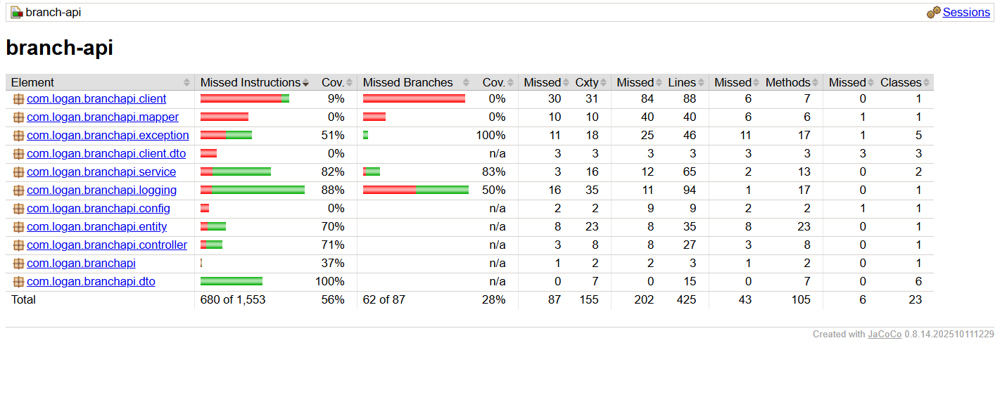

# 🌦️ Branch Weather API


---

## Overview

The **Branch Weather API** is an enterprise-style RESTful backend application built using **Spring Boot**, **Spring Data JPA**, and **Microsoft SQL Server**.

The application provides CRUD operations for branch management while integrating with the **Open-Meteo API** to retrieve live weather information for each branch based on its geographical coordinates.

The project demonstrates modern backend development practices including layered architecture, DTO mapping, validation, external REST integrations, logging, automated testing, and code coverage.

---

# Features

## Branch Management

- Create Branch
- Update Branch
- Delete Branch
- Retrieve Branch by ID
- Retrieve Branch by Branch Code
- Paginated Branch Listing

---

## Live Weather

Retrieve live weather conditions for every branch.

Powered by:

- Open-Meteo API

Returns:

- Temperature
- Relative Humidity
- Wind Speed
- Weather Code

---

## Validation

- Bean Validation
- Duplicate Branch Code detection
- Latitude / Longitude validation
- Request validation
- Pagination validation

---

## Logging

Every HTTP request is logged including:

- Request Method
- URI
- Headers
- Request Body
- Response Body
- Response Status
- Duration
- Correlation ID

---

## Exception Handling

Centralized Global Exception Handler providing consistent JSON error responses.

---

# Architecture

```
                    Client

                       │

               REST Controllers

                       │

                  Service Layer

          ┌────────────┴────────────┐
          │                         │

     Branch Repository        Weather Client

          │                         │

     SQL Server Database      Open-Meteo API
```

---

# Technology Stack

| Technology | Version |
|------------|---------|
| Java | 21 |
| Spring Boot | 4.1 |
| Maven | 3.x |
| Hibernate ORM | 7 |
| Spring Data JPA | ✓ |
| SQL Server | 2022 |
| JUnit 5 | ✓ |
| Mockito | ✓ |
| JaCoCo | ✓ |
| Postman | ✓ |

---

# Project Structure

```
branch-api
│
├── src
│   ├── main
│   │   ├── java
│   │   │   └── com.logan.branchapi
│   │   │        ├── client
│   │   │        ├── config
│   │   │        ├── controller
│   │   │        ├── dto
│   │   │        ├── entity
│   │   │        ├── exception
│   │   │        ├── logging
│   │   │        ├── mapper
│   │   │        ├── repository
│   │   │        └── service
│   │   │
│   │   └── resources
│   │
│   └── test
│       ├── controller
│       ├── repository
│       └── service
│
├── pom.xml
└── README.md
```

---

# Database

Development Database

```
TESTDB
```

Integration Test Database

```
TESTDB_INTEGRATION
```

The integration database is isolated from development to ensure automated tests never modify application data.

---

# REST Endpoints

| Method | Endpoint |
|----------|----------------------------|
| GET | /api/branches |
| GET | /api/branches/{id} |
| GET | /api/branches/code/{branchCode} |
| POST | /api/branches |
| PUT | /api/branches/{id} |
| DELETE | /api/branches/{id} |
| GET | /api/branches/{id}/weather |

---

# Running the Application

Clone the repository

```bash
git clone https://github.com/<your-repository>.git
```

Navigate to the project

```bash
cd branch-api
```

Run the application

```bash
mvn spring-boot:run
```

---

# Running Tests

Execute all tests

```bash
mvn test
```

Run integration tests

```bash
mvn test -Dtest=BranchRepositoryIntegrationTest
```

---

# Code Coverage

Generate JaCoCo report

```bash
mvn clean verify
```

Coverage report location

```
target/site/jacoco/index.html
```

---

# Project Highlights

This project demonstrates:

- RESTful API Design
- Spring Boot Best Practices
- Repository Pattern
- DTO Mapping
- Validation
- Global Exception Handling
- SQL Server Integration
- External REST API Integration
- Logging
- Unit Testing
- Integration Testing
- JaCoCo Code Coverage

---

# Future Enhancements

Potential production improvements include:

- Docker Support
- Testcontainers
- Swagger / OpenAPI
- Spring Security
- JWT Authentication
- GitHub Actions CI/CD
- Kubernetes Deployment
- Redis Caching
- Rate Limiting

---

# Demo

## API Testing


---

## JaCoCo Code Coverage



---

# Author

**Retnalogan Thirujanasambanthan**

Senior Software Engineer

Specializing in Java, Spring Boot, REST APIs, SQL Server, Cloud, DevOps and Enterprise Backend Development.